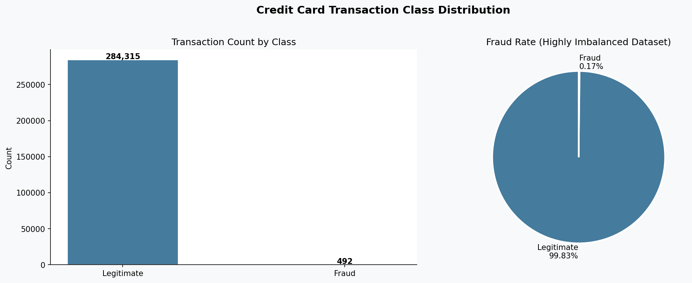
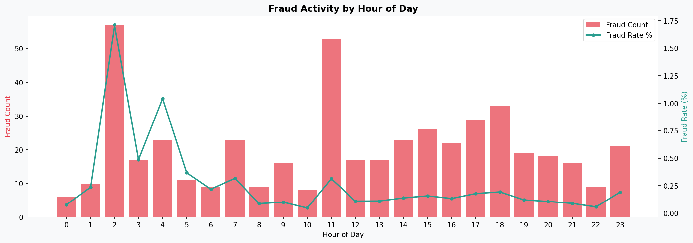
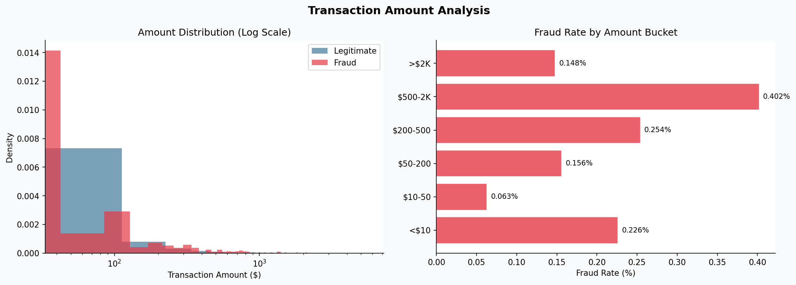
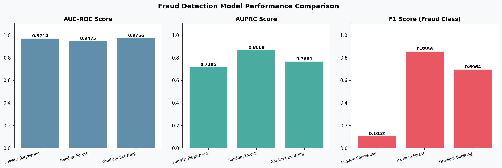
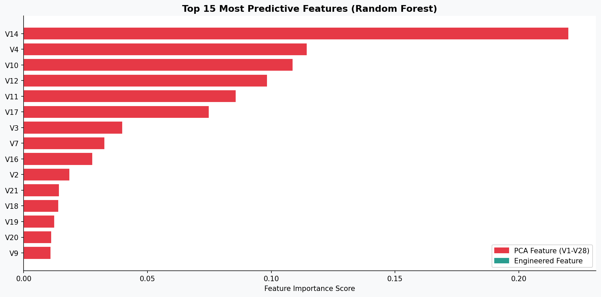
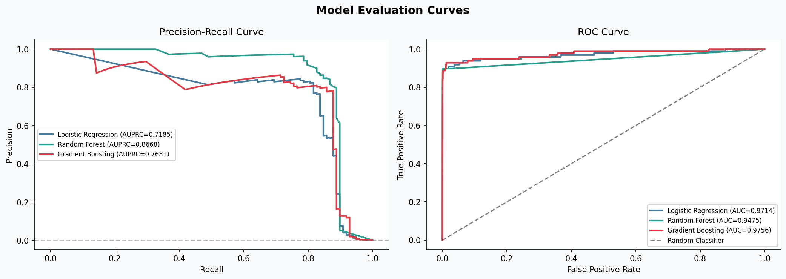

# Credit Card Fraud Detection & AML Analytics

**Author:** Jimmy Le-Nguyen  
**GitHub:** [github.com/jimmyle9080](https://github.com/jimmyle9080)

## Overview

An end-to-end fraud detection and AML analytics pipeline built on the Kaggle Credit Card Fraud Detection dataset (ULB Machine Learning Group). The dataset contains **284,807 real transactions** from European cardholders in September 2013, with **492 fraud cases (0.173%)** - a severely imbalanced classification problem that mirrors real-world AML and fraud detection work.

This project covers the full analytics lifecycle: data ingestion, SQL analysis, feature engineering, machine learning model development, evaluation, ensemble risk scoring, and Power BI-ready reporting exports.

## Key Results

| Model | AUC-ROC | AUPRC | Precision | Recall | F1 |
|---|---|---|---|---|---|
| Logistic Regression | 0.9714 | 0.7185 | 0.0558 | 0.9082 | 0.1052 |
| Random Forest | 0.9475 | 0.8668 | 0.9390 | 0.7857 | 0.8556 |
| Gradient Boosting | 0.9756 | 0.7681 | 0.5772 | 0.8776 | 0.6964 |

- **Random Forest has the best AUPRC at 0.8668** -- best balance between catching fraud and avoiding false alarms
- **Gradient Boosting has the best AUC-ROC at 0.9756** -- strongest overall discrimination ability
- **Logistic Regression has the highest recall at 0.9082** -- catches the most fraud cases but with more false positives
- **AUPRC used as primary metric** -- accuracy is meaningless with a 577:1 class imbalance
- **284,807 transactions scored** with ensemble fraud probability and alert tiering

## Dataset

- **Source:** [Kaggle - Credit Card Fraud Detection](https://www.kaggle.com/datasets/mlg-ulb/creditcardfraud)
- **284,807 transactions** | **492 fraud cases** | **0.173% fraud rate**
- **Total fraud exposure:** $60,127.97
- **Avg fraud transaction:** $122.21 vs $88.29 for legitimate transactions

> Download `creditcard.csv` from Kaggle and place it in the `data/` folder before running.

## Understanding the Dataset Variables

This dataset was collected by Worldline and the Machine Learning Group at ULB (Université Libre de Bruxelles). Due to **confidentiality requirements**, the original transaction features cannot be disclosed. Instead, the raw features were transformed using **PCA (Principal Component Analysis)** - a dimensionality reduction technique that converts correlated variables into a set of uncorrelated components while protecting cardholder identity.

### What the variables actually represent:

| Variable | Type | Description |
|---|---|---|
| `Time` | Original | Seconds elapsed between this transaction and the first transaction in the dataset |
| `Amount` | Original | Transaction amount in euros - the actual dollar value of the purchase |
| `Class` | Original | Target variable: **1 = Fraud**, **0 = Legitimate** |
| `V1` - `V28` | PCA-transformed | Anonymized numerical features representing underlying transaction characteristics such as merchant category, location data, spending velocity, device fingerprints, and behavioral patterns - exact meaning withheld for privacy |

### What PCA transformation means in plain English:

Think of V1-V28 as a coded representation of the original transaction data. Each component (V1, V2, etc.) is a mathematical combination of many original features. For example:
- A high negative value of **V14** tends to strongly indicate fraud -- this component likely captures some combination of unusual merchant behavior, atypical purchase timing, and spending pattern anomalies
- A high negative value of **V4** is associated with fraud -- likely encoding velocity checks or geographic inconsistencies
- **V17, V12, V10** also show strong predictive power for fraud detection

The PCA components with the highest correlation to fraud in this dataset are **V14, V12, V4, V10, and V17** -- these are consistently the top predictors across all three models.

### Engineered features added in this project:

| Feature | Description |
|---|---|
| `Hour` | Hour of day (0-23) derived from the `Time` field -- fraud shows distinct hourly patterns |
| `AmountLog` | Log-transformed transaction amount to reduce right skewness |
| `AmountBucket` | Categorical spend tier: <$10, $10-50, $50-200, $200-500, $500-2K, >$2K |
| `RiskScore` | Composite score calculated from the absolute values of V4, V11, V12, V14, V17 -- the five most fraud-predictive PCA components |

## How to Run

```bash
# 1. Install dependencies
pip install -r requirements.txt

# 2. Navigate into the project folder
cd credit_fraud_project

# 3. Run everything (or open in VS Code and press play on main.py)
python main.py
```

Output folders are created automatically on first run.

## Project Structure

```
credit_fraud_project/
├── data/
│   └── creditcard.csv          # Kaggle dataset (download separately)
├── outputs/
│   ├── charts/                 # 6 professional visualizations
│   └── exports/                # Power BI-ready CSV exports
├── credit_fraud_detection.ipynb  # Jupyter notebook version
├── main.py                     # Single entry point - run this
├── requirements.txt
└── README.md
```

## Outputs

### Charts (outputs/charts/)
| File | Description |
|---|---|
| 1_class_distribution.png | Fraud vs legitimate transaction counts and fraud rate |
| 2_fraud_by_hour.png | Hourly fraud activity pattern with fraud rate overlay |
| 3_amount_analysis.png | Amount distribution and fraud rate by spend bucket |
| 4_model_comparison.png | AUC-ROC, AUPRC, Precision, Recall across 3 models |
| 5_feature_importance.png | Top 15 predictive PCA and engineered features |
| 6_evaluation_curves.png | Precision-Recall and ROC curves for all models |

### Power BI Exports (outputs/exports/)
| File | Description |
|---|---|
| scored_transactions.csv | All 284,807 transactions with fraud probability scores |
| flagged_transactions.csv | High-risk flagged transactions for review |
| fraud_by_hour.csv | Hourly fraud analysis for dashboard |
| fraud_by_amount_bucket.csv | Fraud rate by spend tier |
| model_comparison.csv | Full model performance metrics |
| feature_importance.csv | Top predictive features from Random Forest |
| anomaly_detection.csv | Risk-tiered transaction sample |
| summary_stats.csv | Executive summary statistics |

## Technical Approach

### Why This Problem is Hard
The dataset has a **577:1 class imbalance** -- for every fraud case there are 577 legitimate transactions. A naive model that predicts everything as legitimate would be 99.83% accurate but completely useless for fraud detection. This is why standard accuracy is not a valid metric here.

### Class Imbalance Handling
- **Oversampling** the minority fraud class in training data
- **Class weighting** in Logistic Regression
- **AUPRC as primary metric** -- measures precision-recall tradeoff, not affected by class imbalance
- **Stratified train/test split** to preserve the 0.173% fraud ratio

### Feature Engineering
- `Hour` -- fraud shows distinct temporal patterns by hour of day
- `AmountLog` -- log transform reduces the heavy right skew of transaction amounts
- `AmountBucket` -- categorical spend tiers for segment-level fraud rate analysis
- `RiskScore` -- composite signal from the 5 most fraud-predictive PCA components

### Models
Three models trained and benchmarked:
1. **Logistic Regression** - interpretable baseline, highest recall (catches most fraud)
2. **Random Forest** - best AUPRC at 0.8668, highest precision (fewest false alarms)
3. **Gradient Boosting** - best AUC-ROC at 0.9756, strong overall discrimination

Final scoring uses an **ensemble probability** (average of RF + GB) for production alert tiering: Low / Medium / High / Critical.

### Model Performance Observations
- **Random Forest** is the recommended production model -- its 0.9390 precision means 93.9% of flagged transactions are actually fraud, minimizing analyst workload
- **Logistic Regression** is best for maximum sensitivity environments where missing fraud is costlier than false alarms
- **Gradient Boosting** offers the best overall AUC-ROC and a strong precision-recall balance

## Chart Insights

### Chart 1 - Credit Card Transaction Class Distribution


This chart is the foundation of the entire project -- it shows why fraud detection is such a hard problem. Out of 284,807 real transactions, only 492 are fraud. That is 0.17% of all transactions. The pie chart makes this visually obvious -- fraud is barely a sliver.

This matters because it means a completely useless model that flags nothing as fraud would still be 99.83% accurate. If you just built a model that said "everything is legitimate" you would look great on paper but catch zero fraud. This is why standard accuracy is thrown out entirely and AUPRC becomes the primary metric. The extreme imbalance also explains every modeling decision made in this project -- the oversampling, the class weighting, and the threshold tuning all exist because of what this chart shows.

---

### Chart 2 - Fraud Activity by Hour of Day


This chart shows two things at once -- the raw count of fraud cases per hour (bars) and the fraud rate as a percentage of all transactions that hour (line). The two tell very different stories.

Hour 2am has the highest fraud rate at nearly 1.75% -- meaning almost 1 in 57 transactions at 2am is fraudulent. Hour 11am has the highest raw fraud count at 53 cases but a much lower rate because there is significantly more transaction volume during the day. This distinction is critical in real fraud operations. A fraud analyst monitoring the 2am window needs to be on high alert even though the absolute numbers are small. The late night and early morning hours are disproportionately risky per transaction, likely because fraudsters exploit low transaction volume windows where anomalies are harder to detect in real time.

---

### Chart 3 - Transaction Amount Analysis


The left chart shows that fraudulent transactions (red) cluster heavily in the low amount range -- most fraud happens under $100. Legitimate transactions (blue) are more spread out. This makes intuitive sense because fraudsters often test stolen cards with small transactions first before attempting larger ones.

The right chart tells the more interesting story. The $500-$2K bucket has the highest fraud rate at 0.402% -- nearly double the overall average. This suggests that once a card test succeeds, fraudsters move to mid-to-high value transactions quickly. The very small transactions under $10 also show an elevated fraud rate at 0.226%, which is consistent with the card testing behavior pattern. Together these two charts show that fraud is not random -- it follows predictable amount patterns that a fraud system can learn to flag.

---

### Chart 4 - Fraud Detection Model Performance Comparison


This chart compares all three models across three metrics and the story it tells is nuanced. All three models look similar on AUC-ROC -- all above 0.94 -- which might suggest they are equally good. But the AUPRC chart reveals the truth. Random Forest at 0.8668 is significantly better than Logistic Regression at 0.7185. AUPRC is the honest metric here because it measures how well each model handles the rare fraud class specifically, not just overall discrimination.

The F1 chart shows the sharpest contrast. Random Forest at 0.8556 dramatically outperforms Logistic Regression at 0.1052. Logistic Regression catches a lot of fraud (high recall) but generates so many false alarms that its precision collapses, making it impractical for a real fraud analyst who would be overwhelmed with false positives. Random Forest offers the best real-world balance -- it catches most fraud while keeping false alarms manageable.

---

### Chart 5 - Top 15 Most Predictive Features (Random Forest)


V14 is by far the single most predictive feature with an importance score of over 0.21 -- nearly double the next most important feature V4. All 15 features in the top predictors are PCA components (shown in red), which means none of the engineered features like Hour or AmountLog cracked the top 15. This tells us that the underlying transaction behavior captured in the anonymized PCA components carries far more signal than the observable features like time and amount.

V14, V4, V10, V12, V11, and V17 form a clear top tier of predictors with a significant gap before the remaining features. These six components together likely encode the core behavioral signatures of fraudulent transactions -- things like unusual merchant patterns, atypical geographic behavior, and spending velocity anomalies that the original bank data captured before it was anonymized. In a real fraud system these would be the first features you would want any analyst to understand deeply.

---

### Chart 6 - Model Evaluation Curves


The Precision-Recall curve on the left is the most important chart in the project for understanding real-world fraud detection performance. Random Forest (green) stays high and to the right throughout -- meaning it maintains strong precision even as recall increases. It does not trade off catching fraud against generating false alarms as aggressively as the other two models. Logistic Regression (blue) drops quickly, confirming what the F1 chart showed.

The ROC curve on the right shows all three models well above the random classifier baseline (dashed line), with all curves hugging the top-left corner tightly. All three are strong discriminators. But the ROC curve is the less honest metric here because it includes the easy majority class in its calculation. The Precision-Recall curve is where the real performance differences emerge and where Random Forest clearly wins.

Together these six charts tell a complete story: fraud is rare and hard to find, it has temporal and behavioral patterns that machine learning can learn, and not all models are equally useful even when standard metrics look similar on the surface.

- **Python** - Pandas, NumPy, Scikit-learn, Matplotlib, Seaborn
- **SQL** - SQLite queries with window functions, aggregations, and risk tiering
- **Machine Learning** - Classification, ensemble methods, imbalanced data handling
- **Model Evaluation** - AUC-ROC, AUPRC, Precision-Recall, F1, threshold analysis
- **Feature Engineering** - Time-based features, log transforms, composite risk scoring
- **Financial Domain** - AML, fraud detection, risk tiering, transaction monitoring
- **Data Storytelling** - 6 professional charts and Power BI-ready exports

## License

Dataset licensed under [Open Database License (ODbL)](https://opendatacommons.org/licenses/odbl/).  
Code: MIT License.

